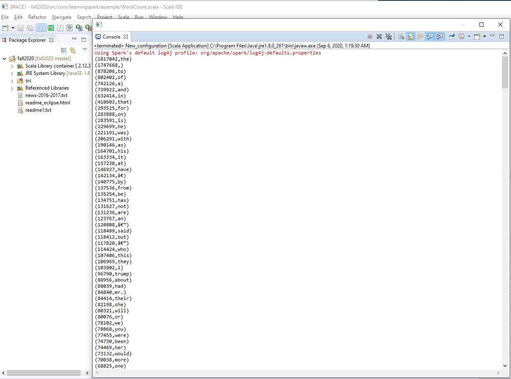

# Assignment 1
#### Dr. Dan Lo
#### Terry Strickland
###### Fall Semester 2020 :shipit:

## Objective
Write a Scala program that take **news-2016-2017.txt** file as **input**\
and **output** the most used 500 words

## Source code
Source code on Github click [HERE](https://raw.githubusercontent.com/wire2coder/fall2020/master/src/com/learningspark/example/WordCount.scala)


``` java
package com.learningspark.example
import org.apache.spark._
import org.apache.spark.SparkContext._
import org.apache.log4j._


object WordCount {
  
  def main( args: Array[String] ) {
    
    // set the log level
    Logger.getLogger("org").setLevel(Level.ERROR)
    
    
    // create 'Spark Context' object
    val sc = new SparkContext( new SparkConf().setAppName("Spark Word Count").setMaster("local") )
    
    // read each line of the text file
    val textfile1 = sc.textFile("./news-2016-2017.txt")
    
    // split the sentences into word with 'empty space'
    val words = textfile1.flatMap( asdf => asdf.split(" ") ) 
      .map( asdf => (asdf.toLowerCase) )
      .map( asdf => (asdf, 1) )
      .reduceByKey( (x,y) => x+y) // combined value with the SAME KEY
      
    val output2 = words.map( asdf => (asdf._2, asdf._1) ).sortByKey(false)  
      
    val output3 = output2.take(500)
    output3.foreach(println)

        
  } // def main
  
} // object
```

## Outputs and Screenshots :thumbsup:

The most used 500 words from the file **news-2016-2017.txt** \
The output is listed in **decesding** order.

### Screeshot



### Console Output

```
Using Spark's default log4j profile: org/apache/spark/log4j-defaults.properties
(1817042,the)
(1747668,)
(878206,to)
(802402,of)
(742126,a)
(739922,and)
(632414,in)
(410603,that)
(293525,for)
(283888,on)
(283591,is)
(229699,he)
(221191,was)
(206291,with)
(190146,as)
(164701,his)
(163334,it)
(157230,at)
(146927,have)
(142134,”)
(140775,by)
(137536,from)
(135254,be)
(134751,has)
(131627,not)
(131236,are)
(123767,an)
(120808,’)
(118489,said)
(118412,but)
(117820,—)
(114424,who)
(107406,this)
(106969,they)
(103902,i)
(96790,trump)
(88956,about)
(88039,had)
(84840,mr.)
(84414,their)
(82198,she)
(80321,will)
(80076,or)
(78102,we)
(78068,you)
(77455,were)
(74730,been)
(74469,her)
(73132,would)
(70038,more)
(68825,one)
(62369,which)
(61450,said.)
(61229,people)
(60798,when)
(60715,new)
(59017,after)
(57131,what)
(55833,also)
(52940,all)
(52896,its)
(52742,if)
(52638,out)
(49714,than)
(47402,president)
(47374,like)
(46443,up)
(45894,can)
(45290,so)
(44379,some)
(43757,our)
(43549,there)
(43528,just)
(43468,into)
(42792,other)
(41217,over)
(40375,no)
(37832,it’s)
(37761,could)
(37037,two)
(36959,him)
(36725,do)
(36663,because)
(36073,first)
(35059,clinton)
(34398,told)
(33744,last)
(32792,how)
(32788,many)
(32063,even)
(31732,most)
(31347,my)
(31315,state)
(31079,those)
(30793,only)
(30085,us)
(29694,them)
(29318,against)
(29149,going)
(28930,news)
(28750,where)
(28656,while)
(28462,trump’s)
(28074,time)
(28025,united)
(27871,get)
(27748,any)
(27217,according)
(27149,before)
(27018,did)
(26948,.)
(26904,during)
(26904,american)
(26880,police)
(26605,donald)
(26464,think)
(26177,now)
(25728,being)
(25346,may)
(24861,these)
(24765,made)
(24611,don’t)
(24382,make)
(23503,national)
(23266,house)
(23264,white)
(23217,said,)
(22572,very)
(22542,s.)
(22491,your)
(22468,u.)
(22465,campaign)
(22172,should)
(22126,years)
(22090,obama)
(21954,former)
(21712,then)
(21670,republican)
(21553,states)
(21436,back)
(21240,government)
(21110,says)
(20911,political)
(20377,since)
(20307,much)
(20291,through)
(20134,“the)
(20109,“i)
(19872,want)
(19439,take)
(19429,between)
(19316,say)
(19232,know)
(19038,including)
(18613,still)
(18459,way)
(18190,see)
(18171,called)
(17688,breitbart)
(17572,down)
(17566,both)
(17524,such)
(17494,000)
(17399,under)
(17396,three)
(17291,another)
(17192,public)
(16965,hillary)
(16788,presidential)
(16593,security)
(16559,that’s)
(16469,ms.)
(16402,me)
(16211,around)
(16150,go)
(15995,percent)
(15946,’’)
(15937,never)
(15846,media)
(15678,own)
(15650,officials)
(15620,part)
(15591,off)
(15543,million)
(15451,twitter)
(15347,support)
(15213,york)
(15200,work)
(15160,world)
(15093,federal)
(15090,same)
(14794,law)
(14553,country)
(14528,2016,)
(14502,need)
(14468,right)
(14409,every)
(14156,follow)
(14088,year)
(14075,asked)
(14043,whether)
(13954,day)
(13826,good)
(13694,found)
(13692,come)
(13580,party)
(13521,took)
(13479,group)
(13460,women)
(13412,really)
(13200,use)
(13185,long)
(13104,democratic)
(13085,it.)
(13003,used)
(12993,department)
(12937,court)
(12851,among)
(12851,next)
(12737,why)
(12721,city)
(12538,north)
(12493,might)
(12360,black)
(12333,man)
(12307,put)
(12303,health)
(12303,came)
(12253,”i)
(12240,few)
(12186,times)
(12072,well)
(12044,got)
(11976,without)
(11964,show)
(11954,several)
(11905,didn’t)
(11877,left)
(11866,recent)
(11846,”the)
(11844,does)
(11781,help)
(11749,family)
(11651,something)
(11613,i’m)
(11582,washington)
(11505,foreign)
(11501,lot)
(11456,bill)
(11407,administration)
(11356,number)
(11270,saying)
(11165,members)
(11108,he’s)
(11081,company)
(11034,business)
(10930,(cnn))
(10928,“we)
(10915,military)
(10856,election)
(10831,…)
(10794,home)
(10664,least)
(10629,little)
(10614,four)
(10564,look)
(10541,reported)
(10427,went)
(10402,here)
(10400,great)
(10354,big)
(10317,policy)
(10199,statement)
(10163,cnn)
(10161,social)
(10097,already)
(10069,republicans)
(10008,vote)
(10000,report)
(9990,days)
(9970,across)
(9921,things)
(9916,become)
(9915,top)
(9907,believe)
(9866,end)
(9763,attack)
(9760,best)
(9707,second)
(9665,south)
(9657,office)
(9651,immigration)
(9624,working)
(9612,secretary)
(9572,each)
(9564,week)
(9555,voters)
(9554,set)
(9502,less)
(9485,a.)
(9483,too)
(9437,making)
(9410,director)
(9390,team)
(9385,likely)
(9382,far)
(9377,school)
(9374,until)
(9372,russian)
(9315,chief)
(9259,general)
(9251,case)
(9244,university)
(9202,john)
(9165,doesn’t)
(9163,place)
(9158,clinton’s)
(9153,trying)
(9146,executive)
(9137,though)
(9098,americans)
(9045,early)
(9039,democrats)
(8979,international)
(8925,seen)
(8922,we’re)
(8872,known)
(8870,life)
(8837,men)
(8835,m.)
(8817,high)
(8809,trump,)
(8800,five)
(8750,islamic)
(8733,once)
(8722,money)
(8713,yet)
(8707,find)
(8645,care)
(8629,change)
(8628,video)
(8626,however,)
(8616,later)
(8589,better)
(8581,always)
(8576,local)
(8559,killed)
(8526,having)
(8522,past)
(8515,order)
(8515,justice)
(8510,keep)
(8497,young)
(8464,america)
(8438,different)
(8421,call)
(8392,information)
(8390,war)
(8382,often)
(8382,major)
(8379,press)
(8357,there’s)
(8354,can’t)
(8304,senate)
(8288,they’re)
(8263,able)
(8219,give)
(8214,must)
(8211,march)
(8172,year,)
(8150,children)
(8103,official)
(8100,real)
(8073,intelligence)
(8069,taking)
(8047,doing)
(7999,away)
(7997,cruz)
(7926,given)
(7897,interview)
(7871,clear)
(7827,taken)
(7821,released)
(7781,decision)
(7720,senior)
(7705,power)
(7669,kind)
(7668,point)
(7628,wrote)
(7619,rights)
(7611,using)
(7584,open)
(7559,ever)
(7540,twitter.)
(7513,important)
(7507,began)
(7481,officers)
(7452,you’re)
(7450,candidate)
(7437,conservative)
(7431,2016)
(7389,behind)
(7368,human)
(7348,free)
(7341,speech)
(7322,deal)
(7262,nearly)
(7218,death)
(7165,live)
(7163,gop)
(7127,despite)
(7126,friday)
(7122,story)
(7122,am)
(7108,comes)
(7107,along)
(7090,actually)
(7087,night)
(7083,legal)
(7071,email)
(7039,almost)
(7038,person)
(7033,getting)
(7009,move)
(7006,outside)
(7006,earlier)
(7001,feel)
(6996,economic)
(6989,months)
(6984,investigation)
(6975,that,)
(6964,wanted)
(6954,russia)
(6952,it,)
(6923,()
(6921,sen.)
(6921,reports)
(6891,run)
(6885,thing)
(6878,others)
(6838,tax)
(6820,within)
(6816,win)
(6812,leaders)
(6810,control)
(6809,close)
(6798,talk)
(6781,trump.)
(6756,led)
(6755,attacks)
(6742,10)
(6736,trade)
(6730,hard)
(6726,thought)
(6710,them.)
(6708,border)
(6702,enough)
(6699,private)
(6689,held)
(6658,became)
(6657,announced)
(6638,someone)
(6633,texas)
(6624,stop)
(6604,woman)
(6598,whose)
(6583,himself)
(6581,won)
(6578,sanders)
(6573,”we)
(6551,european)
(6542,leader)
(6511,coming)
(6499,committee)
(6479,tell)
(6477,continue)
(6470,system)
(6455,muslim)
(6447,time,)
(6434,center)
(6430,thursday)
(6414,plan)
(6398,issue)
(6378,community)
(6371,lead)
(6369,tuesday)
(6355,lost)
(6350,small)
(6329,done)
(6324,companies)
(6316,obama’s)
(6302,full)
(6299,dr.)
(6292,gun)
(6291,started)
(6287,“it)
(6285,mrs.)
(6285,meeting)
(6269,countries)
(6265,six)
```
